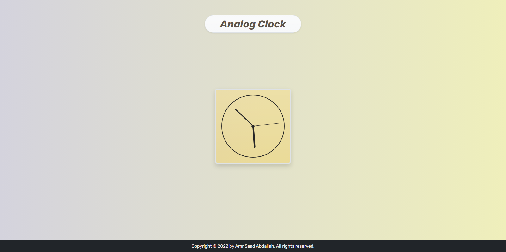
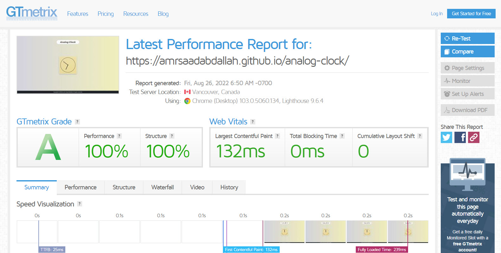

<h1 align="center"> Analog Clock </h1>

### 👁️ Project Preview:

- [ Live Preview 👉 https://amrsaadabdallah.github.io/analog-clock](https://amrsaadabdallah.github.io/analog-clock)

- [ Github Repo 👉 https://github.com/amrsaadabdallah/my-analog-clock](https://github.com/amrsaadabdallah/my-analog-clock)
  - 🚩 It's a private repo <a target="_blank" href="mailto:amrsaadabdallah@gmail.com">contact me </a>to see.

---

### 📝 Project Description & features:

- It's a tiny js webapp (Analog clock) used to practice Vanilla JS.

---

### 🛠️ Project Tools:

1. Used Google Fonts.

1. Bootstrap Classes for styling.

1. ParcelJS a Bundler Tool as I used ES6 modules.

1. [GTmetrix](https://gtmetrix.com/) is an online tool for customers to easily test the performance of their webpages.

---

### :sparkles: Project Skills applied:

1. Link Web Fonts (Rubik) from google fonts.

1. Practice Bootstrap 5 classes to rapid style my project.

1. Applied mibile first technique to create a responsive web app.

1. Write Vanilla JavaScript to create a dynamic web app, EX:

   - analog clock functionality.
   - Update Current year functionality

1. Bundle project by using Parceljs.

1. Test the performance of the webpage after deploy by using [GTmetrix](https://gtmetrix.com/).

---

### 🧪 Project performance test:

Test the performance of the webpage after deploy by using [GTmetrix](https://gtmetrix.com/).

---

### 📚 Resources:

- Create an Analog Clock with Vanilla Javascript(For Beginners) [Nepali Lab](https://dev.to/nepalilab/create-an-analog-clock-with-vanilla-javascript-for-beginners-3ibb).

- CSS + JS Clock - Course by wes bos [wes bos codepen](https://codepen.io/CHUN-PIN-CHEN/pen/yVRBEw).
- Modern minimalistic flat analog clock with css js and startup animation [codeorum](https://codeorum.com/tutorials/modern-minimalistic-flat-analog-clock-with-css-js-and-startup-animation).
- Ligth & dark analog clock [codeorum codepen](https://codepen.io/codeorum/embed/VwaLzqW?default-tab=result&theme-id=light).

---

### 👋 Get In Touch:

- [🌐 Website 👉 https://amrsaadabdallah.github.io](https://amrsaadabdallah.github.io)
- [👔 LinkedIn 👉 https://www.linkedin.com/in/amrsaadabdallah](https://www.linkedin.com/in/amrsaadabdallah)
- [🌟 Github 👉 https://github.com/amrsaadabdallah](https://github.com/amrsaadabdallah)
- [📧 Gmail 👉 amrsaadabdallah@gmail.com](mailto:amrsaadabdallah@gmail.com)
- [🐤 Twitter 👉 https://twitter.com/amrsaadabdallah](https://twitter.com/amrsaadabdallah)
- [:phone: Whatsapp 👉 (+20) 109-775-6067](https://api.whatsapp.com/send/?phone=%2B2001097756067&text&type=phone_number&app_absent=0)

---

<a target="_blank" href="https://amrsaadabdallah.github.io">

 2022 &copy; Amr Saad Abdallah 

</a>

